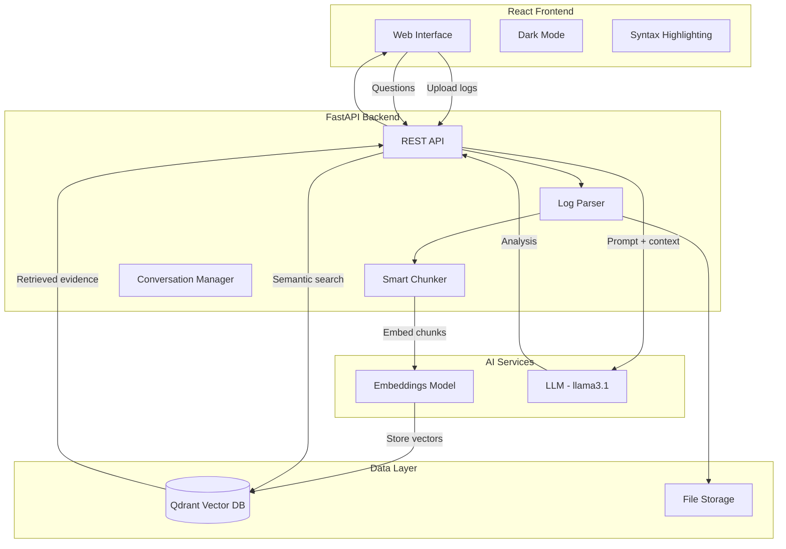
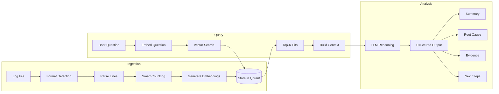
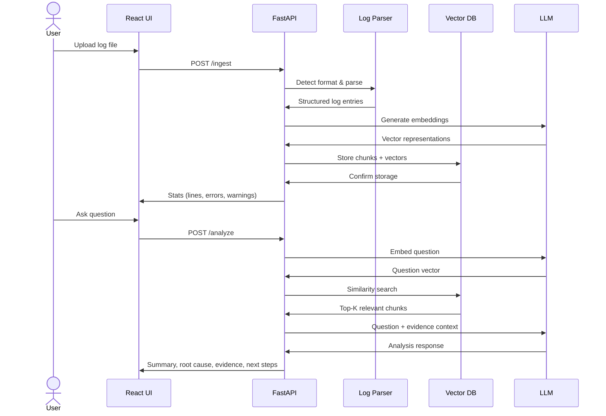
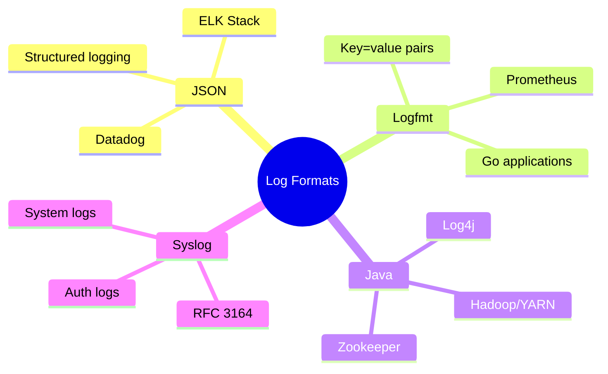
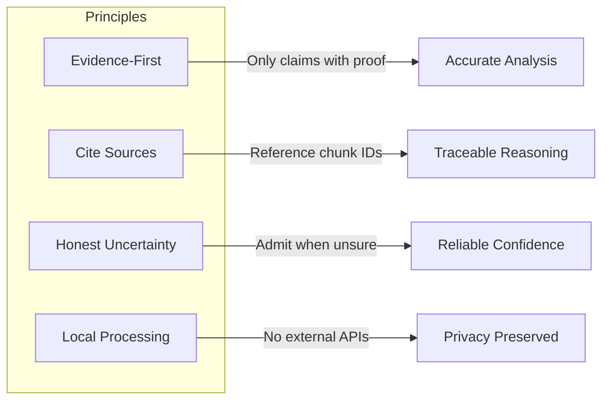

# LLM Incident Copilot

An **evidence-based incident debugging copilot** that ingests logs and uses **vector search + a local LLM (Ollama)** to answer: *"what is failing, why, and what should I check next?"*

Built for SREs, DevOps engineers, and platform teams who want to accelerate incident debugging with AI-powered log analysis.

## Demo

> 🎬 Upload a log file → Ask a question → Get a root-cause hypothesis + evidence citations + next steps

<!-- Add demo GIF here once recorded -->

## System Architecture



## Data Flow



## Features

### Core Capabilities
- ✅ **Evidence-based answers** with citations from log chunks
- ✅ **Confidence scoring** (low/medium/high) based on evidence strength
- ✅ **Multi-turn conversations** for follow-up questions
- ✅ **Local LLM** via Ollama (no API keys needed)
- ✅ **Vector search** with Qdrant for semantic retrieval

### Log Processing
- ✅ **Auto-format detection** (JSON, logfmt, syslog, Java/Hadoop, Zookeeper)
- ✅ **Smart chunking** that respects log structure and error clusters
- ✅ **Real-world datasets** from LogHub (Zookeeper, Hadoop)
- ✅ **Metadata extraction** (timestamps, log levels, loggers)

### User Experience
- ✅ **Dark mode** support with system preference detection
- ✅ **Syntax highlighting** for log levels (ERROR, WARN, INFO)
- ✅ **Log statistics** showing error/warning counts after ingestion
- ✅ **Dataset browser** to explore available sample logs
- ✅ **One-command run** with Docker Compose

## Quickstart

### 1. Clone and start

```bash
git clone https://github.com/Avinash-Amudala/llm-incident-copilot.git
cd llm-incident-copilot
docker compose up --build
```

### 2. Pull the LLM models (one-time setup)

In a new terminal:

```bash
docker exec -it llm-incident-copilot-ollama-1 ollama pull llama3.1
docker exec -it llm-incident-copilot-ollama-1 ollama pull nomic-embed-text
```

### 3. Open the app

- **UI**: [http://localhost:5173](http://localhost:5173)
- **API Docs**: [http://localhost:8000/docs](http://localhost:8000/docs)

### 4. Try it

1. Upload a sample log from `data/sample_logs/`
2. Ask: *"Why are requests timing out?"*
3. Get evidence-based debugging guidance

## How It Works



### Pipeline Steps

1. **Parse**: Auto-detect log format (JSON, logfmt, syslog, Java structured)
2. **Chunk**: Smart chunking that groups by error clusters and time gaps
3. **Embed**: Generate embeddings using Ollama's `nomic-embed-text`
4. **Store**: Save vectors + metadata (timestamps, levels) to Qdrant
5. **Retrieve**: Semantic search finds most relevant log chunks
6. **Reason**: LLM analyzes evidence with strict citation requirements
7. **Respond**: Structured output with summary, root cause, confidence

## Supported Log Formats



## Sample Datasets

### Built-in Samples
| Log File | Scenario | Lines |
|----------|----------|-------|
| `incident_api_timeout.log` | API latency spike from downstream ML service | ~100 |
| `incident_db_connection_pool.log` | Database connection pool exhaustion | ~100 |
| `incident_k8s_crashloop.log` | Kubernetes pod crashloop due to missing config | ~100 |

### LogHub Real-World Datasets
| Dataset | Description | Lines |
|---------|-------------|-------|
| Zookeeper | Distributed coordination service logs | 74,380 |
| Hadoop | MapReduce job execution logs | 394,308 |

## Project Structure

```
llm-incident-copilot/
├── docker-compose.yml          # 4 services: Qdrant, Ollama, Backend, Frontend
├── backend/
│   ├── app/
│   │   ├── main.py             # FastAPI endpoints (ingest, analyze, datasets)
│   │   ├── parsers.py          # Multi-format log parser with auto-detection
│   │   ├── ingest.py           # Smart chunking and stats extraction
│   │   ├── retrieval.py        # Qdrant vector operations
│   │   ├── llm.py              # Ollama integration (embed + chat)
│   │   └── models.py           # Pydantic schemas
│   └── Dockerfile
├── frontend/
│   ├── src/
│   │   ├── App.jsx             # Main app with dark mode toggle
│   │   ├── styles.css          # Modern UI with CSS variables
│   │   ├── api.js              # Backend API client
│   │   └── components/
│   │       ├── UploadPanel.jsx # File upload + dataset browser
│   │       └── ChatPanel.jsx   # Q&A with syntax highlighting
│   └── Dockerfile
├── data/
│   ├── sample_logs/            # Demo incident scenarios
│   └── logs/loghub/            # Real-world datasets (Zookeeper, Hadoop)
└── docs/                       # Architecture diagrams
```

## API Endpoints

| Method | Endpoint | Description |
|--------|----------|-------------|
| `POST` | `/ingest` | Upload and process log file |
| `POST` | `/analyze` | Ask a question about logs |
| `GET` | `/datasets` | List available sample datasets |
| `GET` | `/stats` | Get system statistics |
| `GET` | `/health` | Health check |

## Roadmap

- [x] Multi-format log parser with auto-detection
- [x] Smart chunking by error clusters and time gaps
- [x] Conversation history for follow-up questions
- [x] Dark mode UI with syntax highlighting
- [ ] Streaming responses for better UX
- [ ] Hybrid retrieval (BM25 + vector search)
- [ ] Timeline visualization of incidents
- [ ] Session persistence and export

## Design Principles



- **Evidence-First**: Every claim must be backed by retrieved log chunks
- **Cite Sources**: All conclusions reference specific chunk IDs
- **Honest Uncertainty**: Confidence is "low" when evidence is insufficient
- **Local Processing**: All AI processing happens on your infrastructure

## Author

**Avinash Amudala**
AI Engineer | LLM + Observability | Building Incident Debugging Systems

- GitHub: [@Avinash-Amudala](https://github.com/Avinash-Amudala)

## License

MIT License - see [LICENSE](LICENSE) for details.