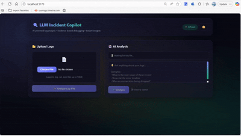
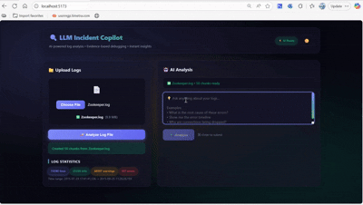
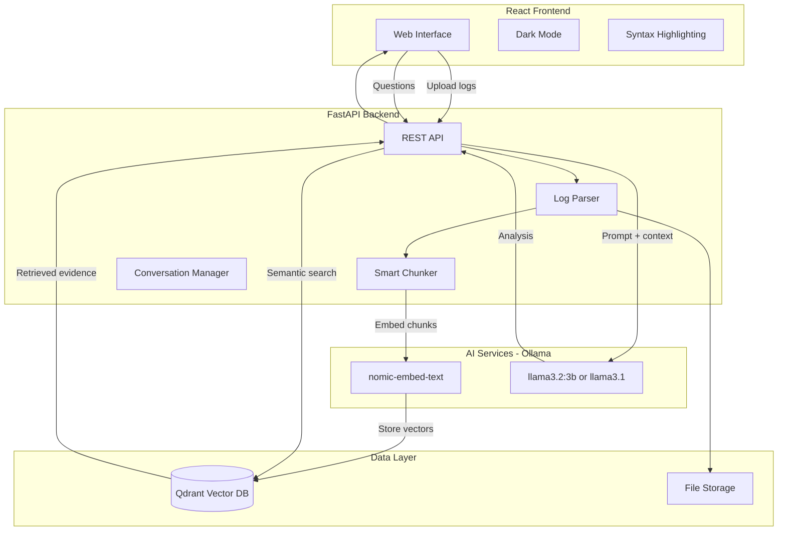
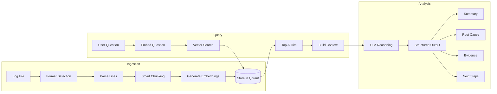
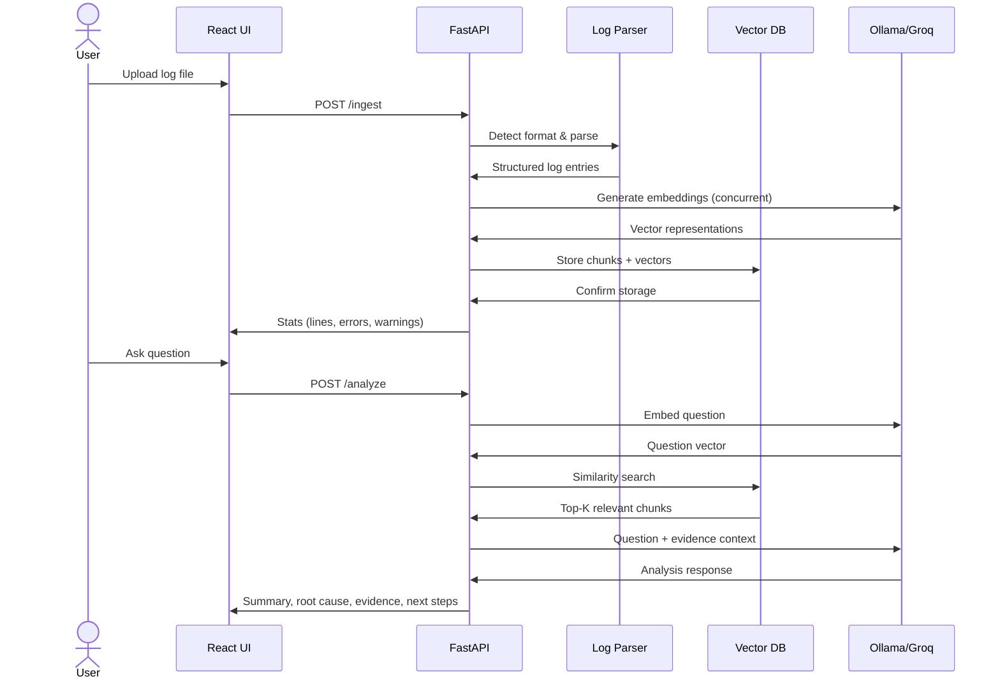
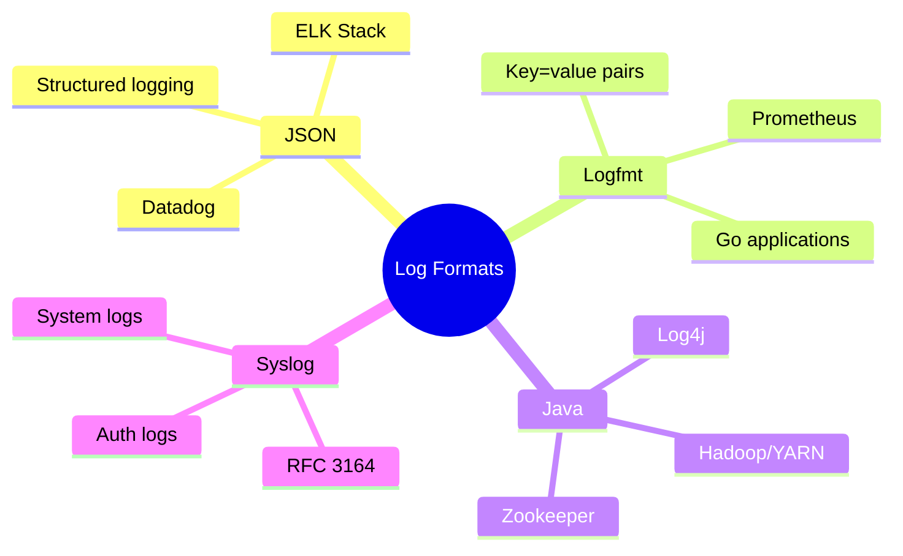

<div align="center">

# 🔍 LLM Incident Copilot

### AI-Powered Log Analysis • Evidence-Based Debugging • Instant Root Cause Analysis

[](https://choosealicense.com/licenses/mit/)
[](https://www.python.org/downloads/)
[](https://fastapi.tiangolo.com/)
[](https://reactjs.org/)
[](https://www.docker.com/)
[](https://qdrant.tech/)

**Upload logs → Ask questions → Get evidence-backed debugging guidance in seconds**

[Features](#-features) • [Quick Start](#-quickstart) • [Demo](#-demo) • [Performance](#-performance) • [Architecture](#system-architecture)

</div>

---

## 🎬 Demo

> **Upload a log file → Ask a question → Get a root-cause hypothesis + evidence citations + next steps**

### 📁 Upload & Analyze Logs

<p align="center">
  
</p>

*Drag and drop any log file • Smart parsing detects format automatically • See processing stats in real-time*

### 🤖 AI-Powered Root Cause Analysis

<p align="center">
  
</p>

*Ask natural language questions • Get evidence-backed answers • Actionable next steps*

---

## ⚡ Performance

Real-world benchmarks on a 10MB log file (74,380 lines):

| Metric | Result | Details |
|--------|--------|---------|
| **Ingestion Time** | 34 seconds | Concurrent embedding with 5 workers |
| **Analysis Time** | 2.5 seconds | Using Groq cloud (vs 30s+ with local Ollama) |
| **Chunks Processed** | 50 chunks | Smart prioritization of error-heavy sections |
| **Memory Usage** | ~500MB | Backend + Qdrant containers |

### 🚀 Speed Optimizations

- **3x faster ingestion** with concurrent embedding (ThreadPoolExecutor)
- **10x faster analysis** with Groq cloud LLM (optional, free tier)
- **Smart chunking** limits processing to most relevant log sections
- **Connection pooling** for efficient API calls

## System Architecture



## Data Flow



## ✨ Features

### 🧠 AI Analysis
| Feature | Description |
|---------|-------------|
| **Evidence-Based Answers** | Every claim backed by cited log chunks |
| **Confidence Scoring** | Low/Medium/High based on evidence strength |
| **Multi-turn Conversations** | Follow-up questions with context |
| **Dual LLM Support** | Groq Cloud (fast) or Ollama (local/private) |
| **RAG Pattern** | Retrieval-Augmented Generation for accuracy |

### 📊 Log Processing
| Feature | Description |
|---------|-------------|
| **Auto-Format Detection** | JSON, logfmt, syslog, Java/Hadoop, Zookeeper |
| **Smart Chunking** | Groups by error clusters and time gaps |
| **Error Prioritization** | Focuses on ERROR/WARN-heavy sections |
| **File Size Limits** | Configurable limits (default: 50MB max) |
| **Concurrent Embedding** | 5x parallel workers for speed |

### 🎨 Modern UI
| Feature | Description |
|---------|-------------|
| **Glassmorphism Design** | Frosted glass panels with blur effects |
| **Animated Gradients** | Dynamic background animations |
| **Dark Mode** | System preference detection with smooth toggle |
| **Syntax Highlighting** | Color-coded ERROR, WARN, INFO levels |
| **Micro-interactions** | Hover effects, pulse animations, slide-ins |

## 🚀 Quickstart

### Prerequisites

- **Docker** and **Docker Compose** installed
- **Ollama** installed locally ([download here](https://ollama.com/download))
- **GPU** (optional but recommended): 4GB+ VRAM for faster inference

### Option A: Quick Start with Groq Cloud (⚡ Recommended)

Get 10x faster inference with Groq's free API:

```bash
# 1. Clone the repo
git clone https://github.com/Avinash-Amudala/llm-incident-copilot.git
cd llm-incident-copilot

# 2. Set up environment variables
cp .env.example .env

# 3. Get your FREE Groq API key
#    Visit: https://console.groq.com/keys
#    Then add to .env:
#    GROQ_API_KEY=gsk_your_key_here

# 4. Install Ollama for embeddings (required)
ollama pull nomic-embed-text

# 5. Start the application!
docker compose up --build
```

### Option B: Fully Local (🔒 Privacy-First)

No external APIs - everything runs on your machine:

```bash
# 1. Install Ollama from https://ollama.com/download
ollama pull nomic-embed-text    # Embeddings (274 MB)
ollama pull llama3.2:3b         # LLM (2 GB) - works on 4GB VRAM

# 2. Clone and start
git clone https://github.com/Avinash-Amudala/llm-incident-copilot.git
cd llm-incident-copilot

# 3. Set up environment (no Groq key needed)
cp .env.example .env

# 4. Start!
docker compose up --build
```

### 🌐 Open the App

| URL | Description |
|-----|-------------|
| [http://localhost:5173](http://localhost:5173) | Web UI |
| [http://localhost:8000/docs](http://localhost:8000/docs) | API Documentation |
| [http://localhost:8000/health](http://localhost:8000/health) | Health Check |

### 🧪 Try It

1. **Upload** a sample log from `data/sample_logs/`
2. **Ask**: *"What is the root cause of this incident?"*
3. **Get** evidence-based debugging guidance with citations

---

## 🔧 Configuration

### LLM Inference Options

| Provider | Speed | Quality | Cost | Setup |
|----------|-------|---------|------|-------|
| **Groq Cloud** | ⚡⚡⚡ 500+ tok/s | Excellent | Free tier | Add `GROQ_API_KEY` |
| **Ollama Local** | ⚡ 15-50 tok/s | Good | Free (GPU) | Default |

### Model Selection

| Model | VRAM | Quality | Provider |
|-------|------|---------|----------|
| `llama-3.1-70b-versatile` | N/A | 🌟🌟🌟 | Groq Cloud |
| `llama-3.1-8b-instant` | N/A | 🌟🌟 | Groq Cloud |
| `llama3.2:3b` | 4GB+ | 🌟 | Ollama |
| `llama3.1` | 8GB+ | 🌟🌟 | Ollama |

### Environment Setup (.env File)

The project uses a `.env` file for configuration. This keeps your API keys secure and out of git:

```bash
# Create your local .env file from the template
cp .env.example .env

# Edit .env and add your Groq API key
# (The .env file is gitignored - your secrets are safe)
```

**Example `.env` file:**

```bash
# 🚀 GROQ CLOUD (RECOMMENDED) - Get free key at https://console.groq.com/keys
GROQ_API_KEY=gsk_your_key_here
GROQ_MODEL=llama-3.1-8b-instant

# 🦙 OLLAMA (always required for embeddings)
OLLAMA_BASE_URL=http://host.docker.internal:11434
OLLAMA_EMBED_MODEL=nomic-embed-text
OLLAMA_MODEL=llama3.2:3b

# ⚡ PERFORMANCE
MAX_CHUNKS=50
EMBEDDING_CONCURRENCY=5

# 📁 FILE LIMITS
MAX_FILE_SIZE_MB=50
WARN_FILE_SIZE_MB=10
```

### All Environment Variables

| Variable | Default | Description |
|----------|---------|-------------|
| `GROQ_API_KEY` | *(empty)* | Groq API key for fast cloud inference |
| `GROQ_MODEL` | `llama-3.1-8b-instant` | Groq model to use |
| `OLLAMA_BASE_URL` | `http://host.docker.internal:11434` | Ollama server URL |
| `OLLAMA_MODEL` | `llama3.2:3b` | Ollama model for LLM (fallback) |
| `OLLAMA_EMBED_MODEL` | `nomic-embed-text` | Ollama model for embeddings |
| `MAX_CHUNKS` | `50` | Max chunks to process per file |
| `EMBEDDING_CONCURRENCY` | `5` | Parallel embedding workers |
| `MAX_FILE_SIZE_MB` | `50` | Reject files larger than this (MB) |
| `WARN_FILE_SIZE_MB` | `10` | Warn for files larger than this (MB) |
| `INFERENCE_PROVIDER` | `auto` | Force provider: `auto`, `groq`, or `ollama` |

---

## 🔧 Troubleshooting

<details>
<summary>🏢 <b>Corporate Network / Proxy Issues</b></summary>

If you're behind a corporate proxy with SSL inspection:

**For Docker builds (pip SSL errors):**
The Dockerfile already includes `--trusted-host` flags to bypass SSL verification.

**For Groq API SSL errors:**
The backend automatically disables SSL verification for corporate MITM proxies.

**For Ollama model downloads:**
```bash
# Temporarily disable proxy
# Windows PowerShell:
$env:HTTP_PROXY = ""
$env:HTTPS_PROXY = ""
$env:NO_PROXY = "*"
ollama pull llama3.2:3b

# Linux/Mac:
HTTP_PROXY="" HTTPS_PROXY="" ollama pull llama3.2:3b
```
</details>

<details>
<summary>🔌 <b>Port Conflicts</b></summary>

If port 11434 is already in use:
```bash
# Check what's using the port
# Windows:
netstat -ano | findstr "11434"
# Linux/Mac:
lsof -i :11434

# Kill the process if needed
# Windows:
taskkill /PID <pid> /F
# Linux/Mac:
kill -9 <pid>
```
</details>

<details>
<summary>🐳 <b>Running Ollama in Docker</b></summary>

If you prefer to run Ollama inside Docker instead of locally:

1. Edit `docker-compose.yml` and uncomment the `ollama` service section
2. Change `OLLAMA_BASE_URL` from `host.docker.internal` to `ollama`
3. Run `docker compose up --build`
4. Pull models inside the container:
```bash
docker exec -it llm-incident-copilot-ollama-1 ollama pull llama3.2:3b
docker exec -it llm-incident-copilot-ollama-1 ollama pull nomic-embed-text
```
</details>

---

## ⚙️ How It Works



### 🔄 Pipeline Steps

| Step | Description |
|------|-------------|
| **1. Parse** | Auto-detect log format (JSON, logfmt, syslog, Java) |
| **2. Chunk** | Smart chunking by error clusters and time gaps |
| **3. Embed** | Generate embeddings with 5 concurrent workers |
| **4. Store** | Save vectors + metadata to Qdrant |
| **5. Retrieve** | Semantic search for relevant chunks |
| **6. Reason** | LLM analyzes evidence with citations |
| **7. Respond** | Structured output with confidence score |

---

## 📋 Supported Log Formats



## 📁 Sample Datasets

### Built-in Samples
| Log File | Scenario | Lines |
|----------|----------|-------|
| `incident_api_timeout.log` | API latency spike from downstream ML service | ~100 |
| `incident_db_connection_pool.log` | Database connection pool exhaustion | ~100 |
| `incident_k8s_crashloop.log` | Kubernetes pod crashloop due to missing config | ~100 |

### LogHub Real-World Datasets
| Dataset | Description | Lines | Size |
|---------|-------------|-------|------|
| Zookeeper | Distributed coordination service logs | 74,380 | 9.94 MB |
| Hadoop | MapReduce job execution logs | 394,308 | 48 MB |

## 📂 Project Structure

```
llm-incident-copilot/
├── docker-compose.yml          # Multi-service orchestration
├── backend/
│   ├── app/
│   │   ├── main.py             # FastAPI endpoints (/ingest, /analyze, /health)
│   │   ├── config.py           # Environment variables & settings
│   │   ├── parsers.py          # Multi-format log parser with auto-detection
│   │   ├── ingest.py           # Smart chunking and stats extraction
│   │   ├── retrieval.py        # Qdrant vector operations
│   │   ├── llm.py              # Ollama/Groq integration (embed + chat)
│   │   └── models.py           # Pydantic schemas
│   └── Dockerfile
├── frontend/
│   ├── src/
│   │   ├── App.jsx             # Main app with dark mode toggle
│   │   ├── styles.css          # Glassmorphism UI with animations
│   │   ├── api.js              # Backend API client
│   │   └── components/
│   │       ├── UploadPanel.jsx # Drag-drop file upload
│   │       └── ChatPanel.jsx   # AI chat with evidence cards
│   └── Dockerfile
├── data/
│   ├── sample_logs/            # Demo incident scenarios
│   └── logs/loghub/            # Real-world datasets (Zookeeper, Hadoop)
└── docs/                       # Architecture diagrams
```

## 🔌 API Endpoints

| Method | Endpoint | Description |
|--------|----------|-------------|
| `POST` | `/ingest` | Upload and process log file (max 50MB) |
| `POST` | `/analyze` | Ask a question about ingested logs |
| `GET` | `/datasets` | List available sample datasets |
| `GET` | `/health` | Health check with config info |

<details>
<summary>📡 <b>API Examples</b> (click to expand)</summary>

```bash
# Health check - shows configuration
curl http://localhost:8000/health
# Returns: {"ok": true, "inference_provider": "groq", "max_file_size_mb": 50, ...}

# Ingest a log file
curl -X POST -F "file=@myapp.log" http://localhost:8000/ingest
# Returns: {"filename": "myapp.log", "chunks_created": 45, "stats": {...}}

# Analyze logs
curl -X POST -H "Content-Type: application/json" \
  -d '{"question": "What is the root cause?", "top_k": 5}' \
  http://localhost:8000/analyze
# Returns: {"summary": "...", "root_cause": "...", "evidence": [...], "next_steps": [...]}
```

</details>

## 🗺️ Roadmap

### ✅ Completed
- [x] Multi-format log parser with auto-detection
- [x] Smart chunking by error clusters and time gaps
- [x] Conversation history for follow-up questions
- [x] Dark mode UI with syntax highlighting
- [x] **Groq Cloud integration** for 10x faster inference
- [x] **Concurrent embedding** (3x faster ingestion)
- [x] **File size limits** with user-friendly errors
- [x] **Futuristic UI** with glassmorphism design

### 🔜 Coming Soon
- [ ] Streaming responses for better UX
- [ ] Hybrid retrieval (BM25 + vector search)
- [ ] Timeline visualization of incidents
- [ ] Session persistence and export
- [ ] Kubernetes deployment with Helm chart
- [ ] OpenAI/Anthropic API support

---

## 🎯 Design Principles

| Principle | Description |
|-----------|-------------|
| 🔍 **Evidence-First** | Every claim must be backed by retrieved log chunks |
| 📎 **Cite Sources** | All conclusions reference specific chunk IDs |
| ⚖️ **Honest Uncertainty** | Confidence is "low" when evidence is insufficient |
| 🔒 **Privacy Option** | Can run fully local with Ollama |

---

## 👤 Author

<div align="center">

**Avinash Amudala**

AI Engineer • LLM Systems • Incident Debugging

[](https://github.com/Avinash-Amudala)

</div>

---

## 📄 License

MIT License - see [LICENSE](LICENSE) for details.

---

<div align="center">

**⭐ Star this repo if you find it useful!**

Made with ❤️ and 🤖

</div>