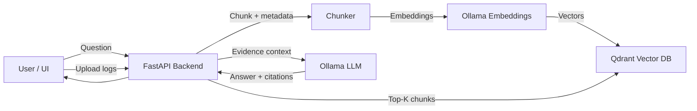

# LLM Incident Copilot

An **evidence-based incident debugging copilot** that ingests logs and uses **vector search + a local LLM (Ollama)** to answer: *"what is failing, why, and what should I check next?"*

## Demo

> 🎬 Upload a log file → Ask a question → Get a root-cause hypothesis + evidence citations + next steps

<!-- Add demo GIF here once recorded -->

## Architecture



## Features

- ✅ **One-command run** with Docker Compose
- ✅ **Sample data included** for immediate demo
- ✅ **Evidence-based answers** with citations from log chunks
- ✅ **Confidence scoring** (low/medium/high)
- ✅ **Local LLM** via Ollama (no API keys needed for core functionality)
- ✅ **Vector search** with Qdrant for semantic retrieval
- ✅ **Modern React UI** with Vite

## Quickstart

### 1. Clone and start

```bash
git clone https://github.com/Avinash-Amudala/llm-incident-copilot.git
cd llm-incident-copilot
docker compose up --build
```

### 2. Pull the LLM models (one-time setup)

In a new terminal:

```bash
docker exec -it llm-incident-copilot-ollama-1 ollama pull llama3.1
docker exec -it llm-incident-copilot-ollama-1 ollama pull nomic-embed-text
```

### 3. Open the app

- **UI**: [http://localhost:5173](http://localhost:5173)
- **API Docs**: [http://localhost:8000/docs](http://localhost:8000/docs)

### 4. Try it

1. Upload a sample log from `data/sample_logs/`
2. Ask: *"Why are requests timing out?"*
3. Get evidence-based debugging guidance

## How It Works

1. **Ingest**: Upload log files → chunked into ~1000 char segments with overlap
2. **Embed**: Each chunk is embedded using Ollama's `nomic-embed-text` model
3. **Store**: Vectors stored in Qdrant with metadata (filename, timestamp)
4. **Retrieve**: Questions are embedded and similar chunks are retrieved (top-K)
5. **Reason**: Retrieved chunks are sent as evidence to Ollama LLM
6. **Respond**: LLM generates summary, root cause, confidence, and next steps

## Sample Incident Scenarios

| Log File | Scenario |
|----------|----------|
| `incident_api_timeout.log` | API latency spike from downstream ML service |
| `incident_db_connection_pool.log` | Database connection pool exhaustion |
| `incident_k8s_crashloop.log` | Kubernetes pod crashloop due to missing config |

## Project Structure

```
llm-incident-copilot/
├── docker-compose.yml      # All services: Qdrant, Ollama, Backend, Frontend
├── backend/
│   ├── app/
│   │   ├── main.py         # FastAPI endpoints
│   │   ├── ingest.py       # Log chunking logic
│   │   ├── retrieval.py    # Qdrant vector operations
│   │   ├── llm.py          # Ollama integration
│   │   └── models.py       # Pydantic schemas
│   └── Dockerfile
├── frontend/
│   ├── src/
│   │   ├── App.jsx         # Main React app
│   │   └── components/     # UploadPanel, ChatPanel
│   └── Dockerfile
├── data/sample_logs/       # Demo incident logs
└── docs/                   # Architecture diagrams
```

## Roadmap

- [ ] Strict JSON output validation with retry logic
- [ ] Better metadata extraction (service, severity, request_id)
- [ ] Hybrid retrieval (BM25 + vector search)
- [ ] Evaluation harness with incident test cases
- [ ] Metrics ingestion (Prometheus snapshots)
- [ ] "Load demo data" button in UI

## Safety & Design Principles

- **Evidence-first**: The LLM only makes claims supported by retrieved log chunks
- **Confidence indicators**: Answers include confidence levels based on evidence strength
- **No hallucinations**: If evidence is insufficient, the system says so
- **Privacy**: All processing is local (no external API calls required)

## Author

**Avinash Amudala**
AI Engineer | LLM + Observability | Building Incident Debugging Systems

- GitHub: [@Avinash-Amudala](https://github.com/Avinash-Amudala)

## License

MIT License - see [LICENSE](LICENSE) for details.